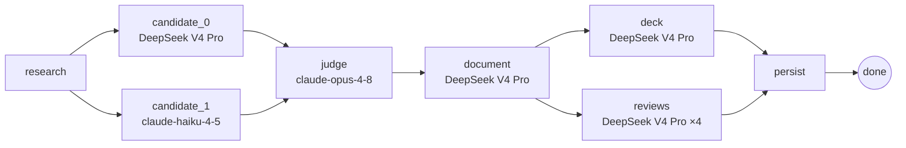

# Design & Engineering Deep-Dive

This document is the engineering companion to the [README](README.md). The README covers
*what APoc is* and *how to run it*; this one covers *how it's built* and — more importantly —
*why it's built that way*. The design decisions and trade-offs below are the parts of this
project worth evaluating.

> APoc was built as an open-source portfolio piece. Where a choice had a cheaper or more
> obvious alternative, the reasoning for taking the harder path is documented inline rather
> than left implicit.

## Contents

1. [Generation pipeline](#generation-pipeline)
2. [Per-stage model assignment](#per-stage-model-assignment)
3. [Provider abstraction](#provider-abstraction)
4. [Grounding layer](#grounding-layer)
5. [Frontend](#frontend)
6. [Data model](#data-model)
7. [Design decisions](#design-decisions)
8. [What this demonstrates](#what-this-demonstrates)
9. [Evaluation methodology](#evaluation-methodology)

---

## Generation pipeline

The core of the project is a **LangGraph `StateGraph`** that encodes the generation flow as
an explicit DAG. The graph topology is defined in
[`backend/app/graph/build.py`](backend/app/graph/build.py):



The parallelism is **explicit, not opportunistic**:

- **`research → {candidate_0, candidate_1}`** — two models see the same research digest and
  produce independent designs, maximising breadth before convergence.
- **`{candidate_0, candidate_1} → judge`** — LangGraph's fan-in waits for both before
  proceeding; the judge (Opus) receives the full text of both candidates and forms a
  canonical design.
- **`document → {deck, reviews}`** — these two nodes write disjoint state keys
  (`deck_html`/`deck_css` vs `reviews`/`annotations`) so they can run in parallel. Within
  `reviews_node`, the four stakeholder lenses are further fanned out via `ThreadPoolExecutor`.
- **`{deck, reviews} → persist`** — fan-in before writing the POC row to SQLite.

Progress events are published at each node and streamed to the frontend over Server-Sent
Events (`/api/projects/{id}/stream`). A running generation is **cancellable** mid-flight:
nodes check a cancellation registry ([`backend/app/cancel.py`](backend/app/cancel.py)) at
phase boundaries and exit cleanly.

---

## Per-stage model assignment

Each pipeline stage is assigned a model deliberately, not uniformly. This is the core
cost/latency engineering of the project.

| Stage | Default model | Reasoning effort | Why |
|---|---|---|---|
| `research` | `deepseek-v4-pro` | `max` | Breadth and citation quality; reasoning earns its latency here |
| `candidate_0` | `deepseek-v4-pro` | `max` | Deep design pass; thinking discovers non-obvious trade-offs |
| `candidate_1` | `claude-haiku-4-5` | n/a | Intentionally lighter — provides a second perspective without doubling cost |
| `judge` | `claude-opus-4-8` | n/a | Discrimination task; Opus is assigned only where the quality decision is made |
| `document` | `deepseek-v4-pro` | `medium` | Transforms a settled design; medium effort is sufficient, sections fan out in parallel |
| `deck` | `deepseek-v4-pro` | **disabled** | Pure text-to-slides reformatting; thinking is explicitly disabled — it wastes tokens on an already-decided layout task |
| `reviews` | `deepseek-v4-pro` | `max` | Each lens is an independent structured analysis; reasoning improves annotation quality |

The two endpoints of this table are the point: the **judge** node uses the most capable model
for the one step where discrimination matters, while the **deck** node explicitly *disables*
thinking because it's a mechanical reformatting task. Spending is concentrated where it
changes the output and withheld where it doesn't.

Every assignment is overridable via environment variable (see the configuration table in the
[README](README.md#-configuration)).

---

## Provider abstraction

[`backend/app/llm.py`](backend/app/llm.py) and [`backend/app/models.py`](backend/app/models.py)
provide a provider-neutral `run_text` / `run_json` API. The same pipeline runs on DeepSeek or
Anthropic; the only difference is which key is present.

DeepSeek-specific concerns are isolated to the LLM layer and the `ai_assist.py` stripper —
none of these leak into generation logic:

- reasoning knobs (effort levels, thinking enable/disable);
- the 8K output cap, handled with truncation-repair;
- tool-call DSML syntax occasionally leaking into prose.

This is deliberately **not** a generic multi-provider framework. It's a thin layer that
isolates the specific quirks of the two providers actually in use, without paying the
abstraction tax of supporting providers that aren't.

---

## Grounding layer

By default: SearXNG generates candidate URLs → Crawl4AI fetches rendered page bodies → the
LLM writes a digest with stable `[s1]` citations. Every claim is traceable to a real URL that
was actually crawled.

Set `APOC_GROUNDING=anthropic_native` to use Anthropic's server-side `web_search` tool
instead. The pipeline falls back to this automatically if SearXNG returns nothing.

See [design decision #3](#3-self-hosted-grounding-rather-than-provider-hosted-web-search) for
why self-hosted grounding is the default.

---

## Frontend

Vite + React 19 + TypeScript + Tailwind v4. Key components:

- **`Dashboard`** — project list + intake (plain-text or PDF upload) and stakeholder switcher
- **`ProjectView`** — the three-column review layout
- **`AnnotationMargin`** — renders line-anchored AI annotations in the middle column
- **`CommentComposer`** — line-anchored comment entry in the review column
- **`DiffView`** — GitHub-style line diff for AI edit proposals (character-level diff via `jsdiff`)
- **`CommentStatus`** — badge + architect lifecycle controls (accept / reject / address)
- **`AiPanel`** — edit instruction input + streaming response with diff preview
- **`Mermaid` / `MermaidLightbox`** — renders architecture diagrams with a click-to-zoom focus modal
- **`MarkdownDoc`** — renders the POC document with anchor-aware scroll

---

## Data model

| Store | What lives there |
|---|---|
| SQLite (`apoc.db`) | Projects, POCs, comments, annotations, review reports, approvals, audit log, research notes |
| `runs/` (filesystem) | Per-run raw LLM outputs, candidate JSON, canonical design, manifest, section artifacts — for inspection and reproducibility |

---

## Design decisions

### 1. Multi-candidate fusion instead of a single generation call

**Problem:** A single LLM call produces one design. The model has no mechanism to surface
trade-offs it considered and rejected.

**Choice:** Two candidates (different models) are generated in parallel and merged by a judge.
The judge receives the full text of both, writes a canonical design, and records `must_fix`
items and section-level guidance that propagates to the document writer.

**Trade-off:** Doubles candidate generation cost and adds a judge call. The payoff is a
document that explicitly acknowledges alternatives — which matters for architecture review,
where the audience asks "what else did you consider?"

### 2. DOC_SECTIONS consolidated from 10 to 7

**Observation:** With 10 independent section calls, each writer could only see its own prompt —
not the other sections' output. The result was that `requirements_mapping`, `nfrs`,
`decisions`, `risks`, and `open_questions` each independently regenerated the same NFR table
and risk list.

**Fix:** Merge sections that share source material:
`requirements_mapping + nfrs → requirements_nfrs`;
`decisions + risks + open_questions → decisions_risks`.

This removes cross-section duplication and cuts two sequential document-writer calls — both a
correctness and a latency win. Documented in [`backend/app/config.py`](backend/app/config.py)
at `DOC_SECTIONS`.

### 3. Self-hosted grounding rather than provider-hosted web search

Three reasons this is load-bearing for the product (not just a default):

- **Auditable** — every claim carries a `[s1]` citation to a URL that was actually crawled. A
  reviewer can follow the link; the reasoning is not opaque.
- **Controllable** — the query text, result count (`APOC_SEARCH_TOPK`), crawl concurrency, and
  timeout are all ours. A black-box search policy can change silently.
- **Provider-neutral** — the same flow works on DeepSeek (which has no hosted search) and
  Anthropic. The hosted path is one env var away for teams that want it.

### 4. Intentionally minimal identity model

Demo mode (`APOC_DEMO_ALL_ADMIN=1`, default on) lets every visitor act as any stakeholder.
This is a deliberate trade-off: it removes friction for a solo demo while keeping all
role-gated behaviour intact — the architect-only edit gate, the per-role approval flow, and
the approval roll-up all work exactly as they would in production. The design makes the
trade-off explicit rather than hiding it behind incomplete auth.

The platform models eight stakeholder roles (`architect`, `compliance`, `security`, `finops`,
`legal`, `cto`, `client_sponsor`, `consultant`). Four of them (`compliance`, `security`,
`finops`, `cto`) produce an AI review lens during generation; five (the four reviewers plus
`architect`) count toward the *ready to align* approval roll-up. The remaining roles
participate in comments and approvals without a dedicated AI lens.

### 5. `GENERATION_MODE` dual-path for safe rollout

The legacy monolithic generation path (`generation.py`) coexists with the new LangGraph graph
path, toggled by `APOC_GENERATION=graph|legacy`. The new path rolled out without deleting the
old one — any regression could be confirmed by switching back in one env var. The legacy path
is still reachable but the default is `graph`.

### 6. AI edit as holistic rewrite, not comment-by-comment patching

When the architect triggers an AI edit, all accepted comments are sent in one call and the
model returns a complete revised document. Patch-by-patch editing compounds errors and
produces inconsistent prose. A full rewrite against all comments simultaneously produces a
coherent result; the diff preview (`DiffView`) gives the architect visibility before
accepting.

The response protocol (document body + trailing fenced JSON `{"addressed": [...]}`) is
deliberately simple and robust to model variation — no tool calls, no streaming JSON, just
text the backend can split on a regex.

---

## What this demonstrates

The engineering choices above are the ones worth evaluating:

- **LLM orchestration** — LangGraph DAG with explicit fan-out/fan-in, not a chain of
  sequential calls. The graph topology is readable in 30 lines.
- **Cost and latency engineering** — per-stage model assignment and per-task reasoning effort
  grading. The deck node explicitly disables thinking; the judge node uses the most capable
  model for the one step where discrimination matters.
- **Auditable AI system design** — every grounding claim is citation-backed; every pipeline
  step is audit-logged; raw LLM outputs are persisted in `runs/` for reproducibility.
- **Provider abstraction done practically** — not a generic multi-provider framework, but a
  thin layer that isolates provider-specific quirks (DeepSeek truncation repair, DSML artifact
  stripping, Anthropic web_search tool shape) without leaking them into generation logic.
- **Iterative refactoring with discipline** — the 10→7 section consolidation and the
  legacy/graph dual path are both examples of observing a specific problem, fixing it narrowly,
  and leaving evidence of the reasoning.
- **Test coverage at both layers** — 27 backend test files covering graph nodes, artifacts, AI
  assist, intake + PDF extraction, research/search, LLM, the eval harness, and API endpoints;
  12 frontend test files covering every major component and utility (vitest + Testing Library).
- **Product judgment** — the product boundary (architecture artifacts only, not code or IaC) is
  a deliberate constraint, not an oversight. APoc does one thing and is honest about what it
  does not do.

---

## Evaluation methodology

> **Goal:** Prove that the judge-merge fusion step adds value over calling a single powerful
> model directly. The sharpest comparison is **canonical (fused) vs. opus_solo** — both receive
> the same research digest and the same output schema; the only difference is whether the
> judge-merge step ran.

### Four contestants

| Contestant | How it is produced | What it isolates |
|---|---|---|
| `candidate_A` | DeepSeek V4 Pro solo, no judge | Baseline: breadth model alone |
| `candidate_B` | claude-haiku-4-5 solo, no judge | Baseline: lightweight model alone |
| `opus_solo` | claude-opus-4-8 solo (same digest, same schema) | The judge model without fusion |
| `canonical` | Judge-merged fusion of A + B | **Full pipeline** |

`candidate_A`, `candidate_B`, and `canonical` are produced by every normal pipeline run at no
extra cost. Only `opus_solo` requires an additional API call — the
`eval.opus_solo.generate(run_dir, brief_text=...)` helper, run after the pipeline completes.

### Objective metrics (deterministic Python)

These metrics are computed with zero LLM calls — they count structure, not prose quality.

| Metric | What it measures | Why fusion should win |
|---|---|---|
| `alternatives_density` | Decisions that include ≥1 substantive alternative / total decisions | The judge is instructed to preserve alternatives from both candidates |
| `risk_specificity` | Risks that have both a `title` and a concrete `mitigation` | Candidate-level risks are often vague; the judge is prompted to make them actionable |
| `structural_completeness` | All 12 schema sections present and non-empty | Fusion fills gaps that any single candidate might leave |

### Langfuse traces

APoc emits a full LangGraph trace to Langfuse when `APOC_LANGFUSE_ENABLED=1`. Each node
(research, candidate_0, candidate_1, judge, document, deck, reviews, persist) appears as a span
with token counts, latency, and model assignment visible in the Langfuse UI.

### Requirement-coverage evaluation (Langfuse native LLM-as-judge)

Coverage uses a frozen requirement checklist (see `backend/eval/briefs/<slug>.json`). Each
requirement is uploaded to a Langfuse dataset as an item (`input` = requirement,
`expected_output` = design's requirements-mapping text). A Langfuse-native LLM-as-judge
evaluator scores each item "addressed" or not.

**To configure the Langfuse native evaluator (one-time UI step):**

1. Open Langfuse → Datasets → select the dataset (e.g., `apoc-coverage`).
2. Click **"Add evaluator"** → **LLM-as-judge**.
3. Set the prompt:
   ```
   Requirement: {{input}}

   Design's requirements mapping:
   {{expected_output}}

   Does the design explicitly address this requirement? Answer with a JSON object:
   {"addressed": true} or {"addressed": false}.
   ```
4. Set output field: `addressed` → score name: `coverage_addressed`.
5. Save. Langfuse will run the evaluator on all existing and new items automatically.

### How to run the full eval

```bash
# 1. Start Langfuse (first time only — takes ~30s). Keys are pre-provisioned by the
#    LANGFUSE_INIT_* vars in .env, so no manual signup or key-copying is needed.
docker compose up -d langfuse-web

# 2. Enable tracing, then run the pipeline through the app (each project generation
#    writes a run directory under backend/runs/). Set the flag before ./run.sh:
export APOC_LANGFUSE_ENABLED=1
#    then create a project and generate it from the UI as usual.

# 3. Produce the opus_solo contestant for a run. eval.opus_solo.generate(run_dir,
#    brief_text=...) reuses the run's persisted research digest, so the only
#    difference from the fused canonical is the fusion step.
cd backend && source .venv/bin/activate
python -c "import json; from eval.opus_solo import generate; \
b=json.load(open('eval/briefs/fintech-payments.json')); \
generate('runs/<run_id>', brief_text=json.dumps(b))"

# 4. Generate the markdown results table across runs (the eval driver CLI):
python -m eval.run_eval \
  --runs runs/<run_id_1> runs/<run_id_2> \
  --slugs fintech-payments ml-feature-store \
  --out eval/report.md
```

Or run the whole thing — stack, tracing, opus_solo, report — in one command:

```bash
./eval.sh fintech-payments ml-feature-store
```
