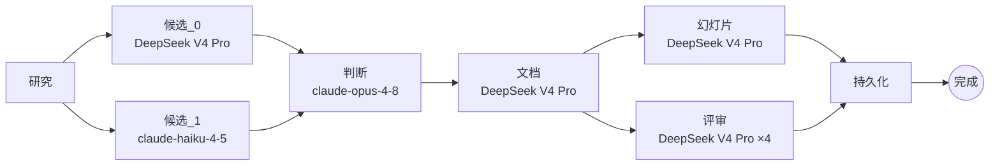

# 设计与工程深度剖析

本文档是 [README](README.zh.md) 的工程配套篇。README 讲清楚 *APoc 是什么*、*怎么跑起来*;
本文档讲 *它是怎么构建的* — 更重要的是 — *为什么这样构建*。下面的设计决策和取舍,
是这个项目最值得评估的部分。

> APoc 作为一个开源 portfolio 项目构建。凡是某个选择存在更便宜或更显而易见的替代方案的地方,
> 选择更难那条路的理由都内联记录下来,而不是留为隐含。

## 目录

1. [生成流水线](#生成流水线)
2. [每阶段模型分配](#每阶段模型分配)
3. [提供者抽象](#提供者抽象)
4. [接地层](#接地层)
5. [前端](#前端)
6. [数据模型](#数据模型)
7. [设计决策](#设计决策)
8. [这个项目展示了什么](#这个项目展示了什么)
9. [评估方法论](#评估方法论)

---

## 生成流水线

项目的核心是一个 **LangGraph `StateGraph`**,它将生成流程编码为一个显式 DAG。
图拓扑定义在 [`backend/app/graph/build.py`](backend/app/graph/build.py):



并行性是**显式的,而非机会主义的**:

- **`研究 → {候选_0, 候选_1}`** — 两个模型看到相同的研究摘要并产出独立的设计,
  在收敛前最大化广度。
- **`{候选_0, 候选_1} → 判断`** — LangGraph 的扇入会等待两者都完成才继续;
  判断模型(Opus)接收两个候选的完整文本并形成一个规范设计。
- **`文档 → {幻灯片, 评审}`** — 这两个节点写入互不相交的状态键
  (`deck_html`/`deck_css` vs `reviews`/`annotations`),因此可以并行运行。
  在 `reviews_node` 内部,四个利益相关方视角通过 `ThreadPoolExecutor` 进一步扇出。
- **`{幻灯片, 评审} → 持久化`** — 在将 POC 行写入 SQLite 之前扇入。

进度事件在每个节点发布,并通过服务器发送事件(`/api/projects/{id}/stream`)流向前端。
运行中的生成可在中途**取消**:节点在阶段边界检查取消注册表
([`backend/app/cancel.py`](backend/app/cancel.py))并干净退出。

---

## 每阶段模型分配

每个流水线阶段都有意分配特定模型,而非统一分配。这是项目核心的成本/延迟工程。

| 阶段 | 默认模型 | 推理努力级别 | 原因 |
|---|---|---|---|
| `研究` | `deepseek-v4-pro` | `max` | 广度和引文质量;推理在这里值回它的延迟 |
| `候选_0` | `deepseek-v4-pro` | `max` | 深度设计通过;思考能发现非显而易见的权衡 |
| `候选_1` | `claude-haiku-4-5` | 无 | 故意较轻 — 提供第二视角而不让成本翻倍 |
| `判断` | `claude-opus-4-8` | 无 | 判别任务;Opus 仅在做质量决策的那一步分配 |
| `文档` | `deepseek-v4-pro` | `medium` | 转换已确定的设计;medium 足够,部分并行扇出 |
| `幻灯片` | `deepseek-v4-pro` | **禁用** | 纯文本→幻灯片重新格式化;思考被显式禁用 — 它会在已确定的布局任务上浪费令牌 |
| `评审` | `deepseek-v4-pro` | `max` | 每个视角都是独立的结构化分析;推理提升注释质量 |

这张表的两个端点正是要点:**判断**节点在唯一需要判别力的那一步使用最强模型,
而**幻灯片**节点显式*禁用*思考,因为它是机械的重新格式化任务。
开销集中在能改变输出的地方,在不能改变的地方则被克制。

每个分配都可通过环境变量覆盖(见 [README](README.zh.md#-配置) 的配置表)。

---

## 提供者抽象

[`backend/app/llm.py`](backend/app/llm.py) 和 [`backend/app/models.py`](backend/app/models.py)
提供一个提供者无关的 `run_text` / `run_json` API。同一流水线在 DeepSeek 或 Anthropic 上运行;
唯一的区别是哪个密钥存在。

DeepSeek 特定的问题被隔离在 LLM 层和 `ai_assist.py` 清理器中 — 它们都不会泄漏到生成逻辑:

- 推理旋钮(努力级别、思考启用/禁用);
- 8K 输出上限,用截断修复处理;
- 工具调用 DSML 语法偶尔泄漏到文本中。

这刻意**不是**一个通用的多提供者框架。它是一个薄层,只隔离实际在用的两个提供者的具体怪癖,
而不为支持那些用不上的提供者付出抽象税。

---

## 接地层

默认:SearXNG 生成候选 URL → Crawl4AI 获取渲染的网页主体 → LLM 写出带稳定 `[s1]` 引文的摘要。
每个声明都可追溯到一个实际爬取过的真实 URL。

设置 `APOC_GROUNDING=anthropic_native` 改用 Anthropic 的服务器端 `web_search` 工具。
如果 SearXNG 没有返回结果,流水线会自动回退到它。

关于为什么自托管接地是默认值,见[设计决策 #3](#3-自托管接地而非提供者托管的网络搜索)。

---

## 前端

Vite + React 19 + TypeScript + Tailwind v4。关键组件:

- **`Dashboard`** — 项目列表 + 接入(纯文本或 PDF 上传)和利益相关方切换器
- **`ProjectView`** — 三列评审布局
- **`AnnotationMargin`** — 在中间列渲染行级 AI 注释
- **`CommentComposer`** — 在评审列进行行级评论录入
- **`DiffView`** — 用于 AI 编辑提案的 GitHub 风格行差异(通过 `jsdiff` 实现字符级差异)
- **`CommentStatus`** — 徽章 + 架构师生命周期控制(接受 / 拒绝 / 处理)
- **`AiPanel`** — 编辑指令输入 + 带差异预览的流式响应
- **`Mermaid` / `MermaidLightbox`** — 渲染架构图,带点击缩放的聚焦模态框
- **`MarkdownDoc`** — 渲染 POC 文档,支持锚点感知滚动

---

## 数据模型

| 存储 | 存放内容 |
|---|---|
| SQLite (`apoc.db`) | 项目、POC、评论、注释、评审报告、批准、审计日志、研究笔记 |
| `runs/`(文件系统) | 每次运行的原始 LLM 输出、候选 JSON、规范设计、清单、部分制品 — 用于检查和重现 |

---

## 设计决策

### 1. 多候选融合而非单次生成调用

**问题:** 单次 LLM 调用产出一个设计。模型没有机制来呈现它考虑过又否决的权衡。

**选择:** 两个候选(不同模型)并行生成并由一个判断模型合并。判断模型接收两者的完整文本,
写出一个规范设计,并记录 `must_fix` 项和传播到文档编写器的部分级指导。

**取舍:** 让候选生成成本翻倍并增加一次判断调用。回报是一份明确承认替代方案的文档 —
这对架构评审很重要,因为受众会问"你还考虑过什么?"

### 2. DOC_SECTIONS 从 10 个合并到 7 个

**观察:** 用 10 个独立的部分调用时,每个编写器只能看到自己的提示 — 看不到其他部分的输出。
结果是 `requirements_mapping`、`nfrs`、`decisions`、`risks` 和 `open_questions`
各自独立地再生了同样的 NFR 表和风险列表。

**修复:** 合并共享源材料的部分:
`requirements_mapping + nfrs → requirements_nfrs`;
`decisions + risks + open_questions → decisions_risks`。

这消除了跨部分重复并减少了两次顺序的文档编写器调用 — 既是正确性的胜利也是延迟的胜利。
记录在 [`backend/app/config.py`](backend/app/config.py) 的 `DOC_SECTIONS` 处。

### 3. 自托管接地而非提供者托管的网络搜索

这对产品是承重的(而不只是一个默认值),有三个理由:

- **可审计** — 每个声明都带有指向实际爬取过的 URL 的 `[s1]` 引文。
  评审者可以点开链接;推理不是不透明的。
- **可控** — 查询文本、结果数(`APOC_SEARCH_TOPK`)、爬取并发和超时都掌握在我们手中。
  一个黑盒搜索策略可能会悄无声息地改变。
- **提供者中立** — 同一流程在 DeepSeek(没有托管搜索)和 Anthropic 上都能工作。
  对想要托管路径的团队来说,它只差一个环境变量。

### 4. 刻意精简的身份模型

演示模式(`APOC_DEMO_ALL_ADMIN=1`,默认开启)让每个访客都能充当任何利益相关方。
这是一个刻意的取舍:它消除了单人演示的摩擦,同时保留所有角色门控行为的完整性 —
架构师专属编辑门控、分角色批准流程和批准汇总的工作方式都与生产中完全相同。
该设计让取舍变得明确,而不是把它藏在不完整的认证后面。

平台建模八个利益相关方角色(`architect`、`compliance`、`security`、`finops`、
`legal`、`cto`、`client_sponsor`、`consultant`)。其中四个(`compliance`、`security`、
`finops`、`cto`)在生成时产出 AI 评审视角;五个(四个评审者加 `architect`)计入
*准备对齐* 批准汇总。其余角色参与评论和批准,但没有专属的 AI 视角。

### 5. `GENERATION_MODE` 双路径以实现安全上线

遗留的单体生成路径(`generation.py`)与新的 LangGraph 图路径共存,
通过 `APOC_GENERATION=graph|legacy` 切换。新路径上线时没有删除旧路径 —
任何回归都可以通过一个环境变量切回来确认。遗留路径仍可访问,但默认是 `graph`。

### 6. AI 编辑作为整体重写,而非逐条评论打补丁

当架构师触发 AI 编辑时,所有接受的评论在一次调用中发送,模型返回一份完整的修订文档。
逐个补丁编辑会累积错误并产生不一致的文字。针对所有评论同时进行的完整重写产出连贯的结果;
差异预览(`DiffView`)让架构师在接受前有可见性。

响应协议(文档主体 + 末尾栅栏 JSON `{"addressed": [...]}`)刻意保持简单且对模型变化鲁棒 —
没有工具调用,没有流式 JSON,只是后端可以用正则切分的文本。

---

## 这个项目展示了什么

上面的工程选择是值得评估的:

- **LLM 编排** — 带显式扇出/扇入的 LangGraph DAG,而非顺序调用链。图拓扑 30 行内可读。
- **成本与延迟工程** — 每阶段模型分配和每任务推理努力分级。幻灯片节点显式禁用思考;
  判断节点在唯一需要判别力的那一步使用最强模型。
- **可审计的 AI 系统设计** — 每个接地声明都有引文支撑;每个流水线步骤都有审计日志;
  原始 LLM 输出持久化在 `runs/` 中以供重现。
- **务实的提供者抽象** — 不是通用多提供者框架,而是一个薄层,隔离提供者特定的怪癖
  (DeepSeek 截断修复、DSML 制品清理、Anthropic web_search 工具形状)而不让它们泄漏到生成逻辑。
- **有纪律的迭代重构** — 10→7 部分合并和 legacy/graph 双路径都是观察到具体问题、
  狭窄地修复它、并留下推理证据的例子。
- **两层的测试覆盖** — 27 个后端测试文件覆盖图节点、制品、AI 助手、接入 + PDF 提取、
  研究/搜索、LLM、eval 工具和 API 端点;12 个前端测试文件覆盖所有主要组件和工具
  (vitest + Testing Library)。
- **产品判断力** — 产品边界(只做架构制品,不做代码或 IaC)是刻意的约束,而非疏忽。
  APoc 专注做一件事,并对它不做什么保持诚实。

---

## 评估方法论

> **目标:** 证明判断-融合步骤相对于直接调用单个强大模型增加了价值。
> 最尖锐的比较是 **canonical(融合)vs. opus_solo** — 两者都接收相同的研究摘要和相同的输出模式;
> 唯一的区别是判断-融合步骤是否运行。

### 四个竞争者

| 竞争者 | 如何产出 | 隔离什么 |
|---|---|---|
| `candidate_A` | DeepSeek V4 Pro 单独,无判断 | 基线:仅广度模型 |
| `candidate_B` | claude-haiku-4-5 单独,无判断 | 基线:仅轻量模型 |
| `opus_solo` | claude-opus-4-8 单独(相同摘要、相同模式) | 没有融合的判断模型 |
| `canonical` | A + B 的判断-融合 | **完整流水线** |

`candidate_A`、`candidate_B` 和 `canonical` 由每次正常流水线运行产出,无额外成本。
只有 `opus_solo` 需要额外的 API 调用 — 即 `eval.opus_solo.generate(run_dir, brief_text=...)`
辅助函数,在流水线完成后运行。

### 客观指标(确定性 Python)

这些指标在零 LLM 调用下计算 — 它们统计结构,而非文字质量。

| 指标 | 衡量什么 | 为什么融合应当胜出 |
|---|---|---|
| `alternatives_density` | 包含 ≥1 个实质性替代方案的决策 / 决策总数 | 判断模型被指示保留两个候选的替代方案 |
| `risk_specificity` | 同时有 `title` 和具体 `mitigation` 的风险 | 候选级风险常常含糊;判断模型被提示让它们可操作 |
| `structural_completeness` | 全部 12 个模式部分都存在且非空 | 融合填补任何单个候选可能留下的空缺 |

### Langfuse 追踪

当 `APOC_LANGFUSE_ENABLED=1` 时,APoc 向 Langfuse 发出完整 LangGraph 追踪。
每个节点(research、candidate_0、candidate_1、judge、document、deck、reviews、persist)
显示为一个跨度,在 Langfuse UI 中可见令牌计数、延迟和模型分配。

### 需求覆盖评估(Langfuse 原生 LLM 即评委)

覆盖使用一个冻结的需求清单(见 `backend/eval/briefs/<slug>.json`)。每个需求作为一个条目
(`input` = 需求,`expected_output` = 设计的需求映射文本)上传到 Langfuse 数据集。
一个 Langfuse 原生的 LLM 即评委评估器为每个条目评分"已处理"或未处理。

**配置 Langfuse 原生评估器(一次性 UI 步骤):**

1. 打开 Langfuse → Datasets → 选择数据集(如 `apoc-coverage`)。
2. 点击 **"Add evaluator"** → **LLM-as-judge**。
3. 设置提示:
   ```
   Requirement: {{input}}

   Design's requirements mapping:
   {{expected_output}}

   Does the design explicitly address this requirement? Answer with a JSON object:
   {"addressed": true} or {"addressed": false}.
   ```
4. 设置输出字段:`addressed` → 评分名称:`coverage_addressed`。
5. 保存。Langfuse 会自动在所有现有和新条目上运行评估器。

### 如何运行完整评估

```bash
# 1. 启动 Langfuse(仅首次 — 约 30 秒)。密钥由 .env 中的 LANGFUSE_INIT_* 变量预配置,
#    所以无需手动注册或复制密钥。
docker compose up -d langfuse-web

# 2. 启用追踪,然后通过应用运行流水线(每次项目生成会在 backend/runs/ 下写一个运行目录)。
#    在 ./run.sh 之前设置标志:
export APOC_LANGFUSE_ENABLED=1
#    然后照常从 UI 创建并生成项目。

# 3. 为一次运行产出 opus_solo 竞争者。eval.opus_solo.generate(run_dir, brief_text=...)
#    复用该运行持久化的研究摘要,所以与融合 canonical 的唯一区别就是融合步骤。
cd backend && source .venv/bin/activate
python -c "import json; from eval.opus_solo import generate; \
b=json.load(open('eval/briefs/fintech-payments.json')); \
generate('runs/<run_id>', brief_text=json.dumps(b))"

# 4. 跨运行生成 markdown 结果表(eval 驱动 CLI):
python -m eval.run_eval \
  --runs runs/<run_id_1> runs/<run_id_2> \
  --slugs fintech-payments ml-feature-store \
  --out eval/report.md
```

或在一条命令中运行整个流程 — 堆栈、追踪、opus_solo、报告:

```bash
./eval.sh fintech-payments ml-feature-store
```
