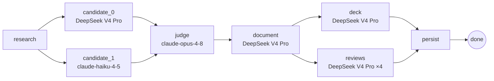

<div align="center">

# 🏛️ APoc

### Architecture POC Workspace

**Turn a plain-text requirement into a reviewed, stakeholder-approved architecture POC — in one pipeline run.**

APoc compresses the slow part of early architecture work — generating a first POC,
getting every stakeholder (compliance, security, FinOps, CTO, architect) to review it,
and reaching alignment — into one auditable workspace instead of a week of meetings.

[](https://www.python.org/)
[](https://react.dev/)
[](https://fastapi.tiangolo.com/)
[](https://github.com/langchain-ai/langgraph)
[](LICENSE)

**English** · [中文](README.zh.md)

[Quick start](#-quick-start) · [How it works](#-how-it-works) · [Configuration](#-configuration) · [Design deep-dive](DESIGN.md)

</div>

---

## ✨ What it does

You describe a system requirement in plain text (or upload a requirements PDF). APoc then:

1. **Researches** the problem against real crawled web pages, with `[s1]`-style citations.
2. **Designs** it twice in parallel with two different LLMs, then **judges** them into one canonical design.
3. **Writes** a seven-section architecture document and an **editable HTML slide deck**.
4. **Reviews** it through four stakeholder lenses (compliance, security, FinOps, CTO) in parallel.
5. **Aligns** everyone in a GitHub-style review UI with line-anchored comments, AI edits, and per-role approvals.

All in a single streamed pipeline run.

> [!NOTE]
> **Product boundary:** APoc produces architecture *artifacts* — design, review, decisions,
> risks, visuals — **not** implementation code, IaC, or deploy configs. It does one thing and is
> honest about what it doesn't do.

<table>
<tr><td>

🧠 **Multi-candidate fusion** — two models design independently, a judge (Opus) merges them
🔎 **Auditable grounding** — every claim cites a URL that was actually crawled
🖼️ **Editable HTML deck** — self-contained slides with click-to-zoom architecture diagrams
👥 **Stakeholder reviews** — 4 AI lenses run in parallel, each with line-anchored annotations

</td><td>

🧑‍💻 **GitHub-style review UI** — document · AI annotations · review comments, three columns
✏️ **AI holistic edit** — architect accepts comments, AI rewrites in one pass with a diff preview
✅ **Approval roll-up** — *ready to align* once all five roles approve
🧾 **Full audit trail** — every step, comment, and approval logged to SQLite + a Trace tab

</td></tr>
</table>

---

## 🚀 Quick start

> **Prerequisites:** [Docker](https://docs.docker.com/get-docker/) (recommended path) **or** Python 3.11+ & Node 20+ for local dev.
> You'll need **one** LLM key: `DEEPSEEK_API_KEY` *or* `ANTHROPIC_API_KEY`.

### Option A — Docker (one command) ⭐

```bash
git clone <repo-url> apoc && cd apoc
cp .env.example .env          # then add your DEEPSEEK_API_KEY or ANTHROPIC_API_KEY
docker compose up --build -d  # frontend + backend + SearXNG, all wired together
```

Open **http://localhost:5174** — that's it.

| Service | URL |
|---|---|
| 🖥️ **Frontend** (use this) | http://localhost:5174 |
| ⚙️ Backend API | http://localhost:8800 |
| 🔎 SearXNG (grounding) | http://localhost:8080 |

### Option B — Local dev (hot reload)

```bash
# 1️⃣ Backend
cd backend
python -m venv .venv && source .venv/bin/activate
pip install -r requirements.txt
crawl4ai-setup                        # installs Playwright Chromium for crawling
export DEEPSEEK_API_KEY=sk-...        # or: export ANTHROPIC_API_KEY=sk-ant-...
./run.sh                              # backend → http://localhost:8800 (auto-starts SearXNG)
```

```bash
# 2️⃣ Frontend (new terminal)
cd frontend
npm install
npm run dev                           # → http://localhost:5174
```

<details>
<summary>No Docker for SearXNG? Use Anthropic's hosted search instead</summary>

```bash
export ANTHROPIC_API_KEY=sk-ant-...
export APOC_GROUNDING=anthropic_native
```

The pipeline also falls back to hosted search automatically if SearXNG returns nothing.
</details>

### 🎬 60-second happy path

Open **http://localhost:5174** → **New project** → describe a system requirement →
watch the pipeline stream its progress → open the finished project to review the
document, stakeholder annotations, and the slide deck → switch role and click **Approve**
to exercise the alignment flow.

---

## 🧩 How it works

The core is a **LangGraph `StateGraph`** — an explicit DAG with real fan-out / fan-in,
not a chain of sequential calls. Topology lives in [`backend/app/graph/build.py`](backend/app/graph/build.py).
For the full architecture write-up — provider abstraction, grounding internals, data model —
see [DESIGN.md](DESIGN.md).



- **`research → {candidate_0, candidate_1}`** — two models see the same digest and design independently, maximizing breadth before convergence.
- **`{candidate_0, candidate_1} → judge`** — fan-in waits for both; Opus reads both full designs and forms one canonical design.
- **`document → {deck, reviews}`** — disjoint state keys, so they run in parallel; the four review lenses fan out further via `ThreadPoolExecutor`.
- **`{deck, reviews} → persist`** — fan-in, then write to SQLite.

Progress streams to the UI over Server-Sent Events. A running generation is **cancellable** mid-flight.

<details>
<summary><b>Per-stage model assignment</b> — each stage gets a model deliberately, not uniformly</summary>

| Stage | Default model | Effort | Why |
|---|---|---|---|
| `research` | `deepseek-v4-pro` | `max` | Breadth & citation quality |
| `candidate_0` | `deepseek-v4-pro` | `max` | Deep design pass; thinking finds non-obvious trade-offs |
| `candidate_1` | `claude-haiku-4-5` | — | Intentionally lighter second perspective, without doubling cost |
| `judge` | `claude-opus-4-8` | — | Discrimination task — Opus only where the quality decision is made |
| `document` | `deepseek-v4-pro` | `medium` | Transforms a settled design; sections fan out in parallel |
| `deck` | `deepseek-v4-pro` | **off** | Pure text→slides reformat; thinking is disabled — it'd waste tokens |
| `reviews` | `deepseek-v4-pro` | `max` | Each lens is an independent structured analysis |

Every assignment is overridable by env var — see [Configuration](#-configuration).
</details>

<details>
<summary><b>Provider abstraction, grounding & frontend</b></summary>

**Provider abstraction** — [`backend/app/llm.py`](backend/app/llm.py) exposes a provider-neutral
`run_text` / `run_json` API. The same pipeline runs on DeepSeek or Anthropic; the only difference
is which key is present. Provider quirks (DeepSeek reasoning knobs, the 8K output cap with
truncation-repair, DSML tool-call syntax leaking into prose) are isolated to the LLM layer — none
leak into generation logic.

**Grounding** — by default: SearXNG discovers URLs → Crawl4AI fetches rendered page bodies → the
LLM writes a digest with stable `[s1]` citations. Set `APOC_GROUNDING=anthropic_native` to use
Anthropic's server-side `web_search` tool instead.

**Frontend** — Vite + React 19 + TypeScript + Tailwind v4. Key pieces: `Dashboard` (project list +
intake + role switcher), `ProjectView` (three-column review), `AnnotationMargin`, `CommentComposer`,
`DiffView` (character-level GitHub-style diff), `AiPanel`, `Mermaid` + `MermaidLightbox` (click-to-zoom).

**Data model** — SQLite (`apoc.db`) holds projects, POCs, comments, annotations, reviews, approvals,
and the audit log; `runs/` on disk holds per-run raw LLM outputs and artifacts for reproducibility.
</details>

---

## ⚙️ Configuration

All settings come from environment variables (existing env vars win over `.env`).
The only thing you *must* set is one LLM key.

| Variable | Default | Purpose |
|---|---|---|
| `DEEPSEEK_API_KEY` | — | DeepSeek key; if set, DeepSeek is the default provider |
| `ANTHROPIC_API_KEY` | — | Anthropic key; used when no DeepSeek key is present |
| `APOC_PROVIDER` | auto | Force `deepseek` or `anthropic` |
| `APOC_GROUNDING` | `searxng` | `searxng` (SearXNG + Crawl4AI) or `anthropic_native` |
| `APOC_GENERATION` | `graph` | `graph` (LangGraph fusion) or `legacy` |
| `APOC_DEMO_ALL_ADMIN` | `1` | `1` = any visitor may act as any role |
| `APOC_PORT` | `8800` | Backend listen port |

<details>
<summary>Grounding tuning & per-stage model overrides</summary>

| Variable | Default | Purpose |
|---|---|---|
| `APOC_SEARXNG_URL` | `http://localhost:8080` | SearXNG instance URL |
| `APOC_SEARCH_TOPK` | `4` | Results per query |
| `APOC_CRAWL_CONCURRENCY` | `4` | Parallel Crawl4AI fetches |
| `APOC_CRAWL_TIMEOUT` | `30` | Per-page crawl timeout (seconds) |
| `APOC_FRONTEND_ORIGIN` | `http://localhost:5174` | CORS origin for the Vite dev server |
| `APOC_FUSION_RESEARCH_MODEL` | `deepseek-v4-pro` | Research node |
| `APOC_FUSION_CANDIDATE_A` | `deepseek-v4-pro` | First candidate |
| `APOC_FUSION_CANDIDATE_B` | `claude-haiku-4-5` | Second candidate |
| `APOC_FUSION_JUDGE_MODEL` | `claude-opus-4-8` | Judge |
| `APOC_FUSION_DOCUMENT_MODEL` | `deepseek-v4-pro` | Document writer |
| `APOC_FUSION_DECK_MODEL` | `deepseek-v4-pro` | Deck builder |
| `APOC_FUSION_REVIEW_MODEL` | `deepseek-v4-pro` | Stakeholder review lenses |
| `APOC_AI_EDIT_MODEL` | `deepseek-v4-pro` | AI edit + chat |
| `APOC_EXTRACTION_MODEL` | provider default | Brief extraction from an uploaded PDF |

</details>

---

## 🧠 Design decisions

The engineering choices below are the ones worth evaluating. Each is covered in full —
problem, choice, and trade-off — in the **[Design & Engineering Deep-Dive →](DESIGN.md)**.

- **Multi-candidate fusion over a single call** — two candidates (different models) generated in
  parallel and merged by a judge that records `must_fix` items and section guidance. Costs ~2×
  candidate generation, but produces a document that explicitly acknowledges alternatives — exactly
  what architecture reviewers ask for.
- **Sections consolidated 10 → 7** — independent section writers were each regenerating the same NFR
  table and risk list. Merging sections that share source material removed cross-section duplication
  *and* cut two sequential LLM calls. Both a correctness and a latency win.
- **Self-hosted grounding** — auditable (every claim links to a crawled URL), controllable (query,
  top-k, concurrency, timeout are all ours), and provider-neutral (works without any hosted search).
- **AI edit as a holistic rewrite** — all accepted comments go in one call and the model returns a
  full revised document; patch-by-patch editing compounds errors. A simple protocol (document body +
  trailing fenced JSON) keeps it robust to model variation.
- **`graph`/`legacy` dual path** — the LangGraph path rolled out without deleting the monolithic one,
  so any regression could be confirmed by flipping a single env var.

<details>
<summary>Why demo mode lets anyone be any role</summary>

`APOC_DEMO_ALL_ADMIN=1` (default) lets every visitor act as any stakeholder — a deliberate trade-off
that removes friction for a solo demo while keeping every role-gated behaviour intact: the
architect-only edit gate, per-role approvals, and the *ready to align* roll-up all work exactly as
they would in production. The design makes the trade-off explicit rather than hiding it behind
incomplete auth.
</details>

---

## 🧪 Testing

```bash
# Backend (pytest) — 27 test files
cd backend && source .venv/bin/activate && pytest tests/ -v

# Frontend (vitest) — 12 test files
cd frontend && npm run test
```

Backend tests cover graph nodes, artifact storage, LLM provider abstraction, AI-assist (edit
protocol + tool-artifact stripping), intake/PDF extraction, research/search, and API endpoints.
Frontend tests cover every major component and the `api` / `diff` / `markdown` utilities.

---

## 📊 Evaluation

> **Goal:** prove the judge-merge fusion step adds value over calling a single powerful model directly.
> The sharpest comparison is **canonical (fused) vs. opus_solo** — same digest, same schema; the only
> difference is whether the judge-merge step ran.

The eval pits four contestants — `candidate_A`, `candidate_B`, `opus_solo`, and the fused
`canonical` — and scores them on deterministic, LLM-free metrics (`alternatives_density`,
`risk_specificity`, `structural_completeness`), plus optional Langfuse LLM-as-judge requirement coverage.

<details>
<summary>How to run the full eval</summary>

```bash
# 1. Start Langfuse (first boot ~30s; keys are pre-provisioned by LANGFUSE_INIT_* in .env)
docker compose up -d langfuse-web

# 2. Enable tracing, then generate projects from the UI (each run writes backend/runs/<id>/)
export APOC_LANGFUSE_ENABLED=1   # set before ./run.sh, then generate as usual

# 3. Produce the opus_solo contestant for a run (reuses the run's persisted research digest)
cd backend && source .venv/bin/activate
python -c "import json; from eval.opus_solo import generate; \
b=json.load(open('eval/briefs/fintech-payments.json')); \
generate('runs/<run_id>', brief_text=json.dumps(b))"

# 4. Generate the markdown results table across runs
python -m eval.run_eval \
  --runs runs/<run_id_1> runs/<run_id_2> \
  --slugs fintech-payments ml-feature-store \
  --out eval/report.md
```

Or run the whole thing — stack, tracing, opus_solo, report — in one command:

```bash
./eval.sh fintech-payments ml-feature-store
```

APoc emits a full LangGraph trace to Langfuse when `APOC_LANGFUSE_ENABLED=1`: each node appears as a
span with token counts, latency, and model assignment.
</details>

---

## 🗂️ Project layout

```
apoc/
├── backend/
│   ├── app/
│   │   ├── graph/          # LangGraph pipeline (build.py, nodes.py, state.py, run.py)
│   │   ├── main.py         # FastAPI app — 23 REST endpoints
│   │   ├── llm.py          # Provider-neutral LLM calls (Anthropic + DeepSeek)
│   │   ├── research.py     # Research orchestration + [s1]-cited digest
│   │   ├── search.py       # SearXNG discovery + Crawl4AI crawling
│   │   ├── deck.py         # Editable single-file HTML deck assembler
│   │   ├── ai_assist.py    # AI edit & chat server logic
│   │   ├── config.py       # All runtime configuration
│   │   └── prompts.py      # All LLM prompts
│   ├── eval/               # Fusion-ablation eval harness (metrics, judge, Langfuse sync)
│   ├── tests/              # 27 pytest files
│   └── run.sh              # Local start script (venv detection, SearXNG health check)
├── frontend/               # Vite + React 19 + TS + Tailwind v4 (12 vitest files)
├── docker-compose.yml      # Full stack: frontend + backend + SearXNG (+ optional Langfuse)
├── eval.sh                 # One-command full eval
└── searxng/                # SearXNG settings
```

---

## 📄 License

[MIT](LICENSE) © 2026 Tinggao Cui

## 🙏 Acknowledgements

The slide deck runtime is inspired by
[frontend-slides](https://github.com/zarazhangrui/frontend-slides) and
[frontend-slides-editable](https://github.com/archlizheng/frontend-slides-editable).
