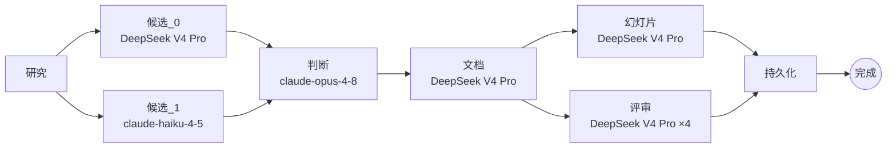

<div align="center">

# 🏛️ APoc

### 架构 POC 工作空间

**将一份纯文本需求转化为评审通过、利益相关方批准的架构 POC — 一次流水线运行完成。**

APoc 将早期架构工作中耗时的部分 — 生成初版 POC、让每个利益相关方（合规、安全、FinOps、CTO、架构师）评审，达成一致 — 压缩到一个可审计的工作空间中，而不是数天的会议。

[](https://www.python.org/)
[](https://react.dev/)
[](https://fastapi.tiangolo.com/)
[](https://github.com/langchain-ai/langgraph)
[](LICENSE)

[English](README.md) · **中文**

[快速开始](#-快速开始) · [工作原理](#-工作原理) · [配置](#-配置) · [设计深度剖析](DESIGN.zh.md)

</div>

---

## ✨ 功能说明

你用纯文本描述系统需求（或上传需求 PDF）。APoc 随后会：

1. **研究** 问题并根据真实爬取的网页进行研究，使用 `[s1]` 风格的引文。
2. **设计** 两次（用两个不同的 LLM），然后**判断**将其融合为一个规范设计。
3. **编写** 一份七部分的架构文档和**可编辑的 HTML 幻灯片**。
4. **评审** 通过四个利益相关方角度（合规、安全、FinOps、CTO）并行进行。
5. **对齐** 所有人在 GitHub 风格的评审 UI 中，支持行级注释、AI 编辑和分角色批准。

所有这些都在单次流水线运行中完成。

> [!NOTE]
> **产品边界：** APoc 生成架构 *制品* — 设计、评审、决策、风险、可视化 — **不是** 实现代码、IaC 或部署配置。它专注做一件事。

<table>
<tr><td>

🧠 **多候选融合** — 两个模型独立设计，判断模型（Opus）将其合并
🔎 **可审计的接地** — 每个声明都引用一个实际爬取过的网址
🖼️ **可编辑的 HTML 幻灯片** — 自包含的幻灯片，支持点击缩放的架构图
👥 **利益相关方评审** — 4 个 AI 视角并行运行，每个都有行级注释

</td><td>

🧑‍💻 **GitHub 风格的评审 UI** — 文档 · AI 注释 · 评审评论，三列布局
✏️ **AI 整体编辑** — 架构师接受评论，AI 一次性重写并预览差异
✅ **批准汇总** — 五个角色都批准后标记为 *准备对齐*
🧾 **完整审计线索** — 每个步骤、评论和批准都记录到 SQLite + 追踪选项卡

</td></tr>
</table>

---

## 🚀 快速开始

> **前置条件：** [Docker](https://docs.docker.com/get-docker/)（推荐）**或** Python 3.11+ 和 Node 20+（本地开发）。
> 你需要 **一个** LLM 密钥：`DEEPSEEK_API_KEY` *或* `ANTHROPIC_API_KEY`。

### 选项 A — Docker（一条命令）⭐

```bash
git clone <repo-url> apoc && cd apoc
cp .env.example .env          # 然后添加 DEEPSEEK_API_KEY 或 ANTHROPIC_API_KEY
docker compose up --build -d  # 前端 + 后端 + SearXNG，完全连接
```

打开 **http://localhost:5174** — 完成。

| 服务 | URL |
|---|---|
| 🖥️ **前端**（使用这个） | http://localhost:5174 |
| ⚙️ 后端 API | http://localhost:8800 |
| 🔎 SearXNG（接地） | http://localhost:8080 |

### 选项 B — 本地开发（热重载）

```bash
# 1️⃣ 后端
cd backend
python -m venv .venv && source .venv/bin/activate
pip install -r requirements.txt
crawl4ai-setup                        # 为爬取安装 Playwright Chromium
export DEEPSEEK_API_KEY=sk-...        # 或：export ANTHROPIC_API_KEY=sk-ant-...
./run.sh                              # 后端 → http://localhost:8800（自动启动 SearXNG）
```

```bash
# 2️⃣ 前端（新终端）
cd frontend
npm install
npm run dev                           # → http://localhost:5174
```

<details>
<summary>没有 Docker 的 SearXNG？改用 Anthropic 托管搜索</summary>

```bash
export ANTHROPIC_API_KEY=sk-ant-...
export APOC_GROUNDING=anthropic_native
```

如果 SearXNG 没有返回结果，流水线也会自动回退到托管搜索。
</details>

### 🎬 60 秒快速体验

打开 **http://localhost:5174** → **新建项目** → 描述系统需求 →
观看流水线流式输出进度 → 完成后打开项目查看文档、利益相关方注释和幻灯片 →
切换角色点击**批准**来体验对齐流程。

---

## 🧩 工作原理

核心是一个 **LangGraph `StateGraph`** — 一个具有真实扇出/扇入的显式 DAG，
而不是顺序调用链。拓扑定义在 [`backend/app/graph/build.py`](backend/app/graph/build.py)。
完整的架构剖析 — 提供者抽象、接地内部、数据模型 — 见 [DESIGN.zh.md](DESIGN.zh.md)。



- **`研究 → {候选_0, 候选_1}`** — 两个模型看到相同的摘要并独立设计，最大化收敛前的广度。
- **`{候选_0, 候选_1} → 判断`** — 扇入等待两个完成；Opus 读取两个完整设计并形成一个规范设计。
- **`文档 → {幻灯片, 评审}`** — 独立的状态键，所以它们并行运行；四个评审视角通过 `ThreadPoolExecutor` 进一步扇出。
- **`{幻灯片, 评审} → 持久化`** — 扇入，然后写入 SQLite。

进度通过服务器发送事件流向 UI。运行中的生成可以在任何时候**取消**。

<details>
<summary><b>每阶段模型分配</b> — 每个阶段有意分配特定模型，而不是统一分配</summary>

| 阶段 | 默认模型 | 努力级别 | 原因 |
|---|---|---|---|
| `研究` | `deepseek-v4-pro` | `max` | 广度和引文质量 |
| `候选_0` | `deepseek-v4-pro` | `max` | 深度设计通过；思考能发现非显而易见的权衡 |
| `候选_1` | `claude-haiku-4-5` | — | 故意较轻的第二视角，不增加成本 |
| `判断` | `claude-opus-4-8` | — | 判别任务 — Opus 仅在质量决策处使用 |
| `文档` | `deepseek-v4-pro` | `medium` | 转换已确定的设计；部分并行扇出 |
| `幻灯片` | `deepseek-v4-pro` | **关闭** | 纯文本→幻灯片重新格式化；思考会浪费令牌 |
| `评审` | `deepseek-v4-pro` | `max` | 每个视角都是独立的结构化分析 |

每个分配都可通过环境变量覆盖 — 参见[配置](#-配置)。
</details>

<details>
<summary><b>提供者抽象、接地和前端</b></summary>

**提供者抽象** — [`backend/app/llm.py`](backend/app/llm.py) 暴露一个提供者无关的
`run_text` / `run_json` API。同一流水线在 DeepSeek 或 Anthropic 上运行；唯一的区别是哪个密钥存在。
提供者怪癖（DeepSeek 推理旋钮、8K 输出限制修复、DSML 工具调用语法泄漏到文本）
隔离在 LLM 层 — 不会泄漏到生成逻辑中。

**接地** — 默认：SearXNG 发现 URL → Crawl4AI 获取渲染的网页主体 → LLM 写出带 `[s1]` 引文的摘要。
设置 `APOC_GROUNDING=anthropic_native` 改用 Anthropic 的服务器端 `web_search` 工具。

**前端** — Vite + React 19 + TypeScript + Tailwind v4。关键部分：`Dashboard`（项目列表 +
接入 + 角色切换器）、`ProjectView`（三列评审）、`AnnotationMargin`、`CommentComposer`、
`DiffView`（字符级 GitHub 风格差异）、`AiPanel`、`Mermaid` + `MermaidLightbox`（点击缩放）。

**数据模型** — SQLite（`apoc.db`）保存项目、POC、评论、注释、评审、批准和审计日志；
`runs/` 磁盘目录保存每次运行的原始 LLM 输出和制品以供重现。
</details>

---

## ⚙️ 配置

所有设置来自环境变量（现有环境变量优先于 `.env`）。
你 *必须* 设置一个 LLM 密钥。

| 变量 | 默认值 | 用途 |
|---|---|---|
| `DEEPSEEK_API_KEY` | — | DeepSeek 密钥；如果设置，DeepSeek 是默认提供者 |
| `ANTHROPIC_API_KEY` | — | Anthropic 密钥；当没有 DeepSeek 密钥时使用 |
| `APOC_PROVIDER` | auto | 强制 `deepseek` 或 `anthropic` |
| `APOC_GROUNDING` | `searxng` | `searxng`（SearXNG + Crawl4AI）或 `anthropic_native` |
| `APOC_GENERATION` | `graph` | `graph`（LangGraph 融合）或 `legacy` |
| `APOC_DEMO_ALL_ADMIN` | `1` | `1` = 任何访客都可以充当任何角色 |
| `APOC_PORT` | `8800` | 后端监听端口 |

<details>
<summary>接地调优和每阶段模型覆盖</summary>

| 变量 | 默认值 | 用途 |
|---|---|---|
| `APOC_SEARXNG_URL` | `http://localhost:8080` | SearXNG 实例 URL |
| `APOC_SEARCH_TOPK` | `4` | 每个查询的结果数 |
| `APOC_CRAWL_CONCURRENCY` | `4` | 并行 Crawl4AI 获取数 |
| `APOC_CRAWL_TIMEOUT` | `30` | 单页爬取超时（秒） |
| `APOC_FRONTEND_ORIGIN` | `http://localhost:5174` | Vite 开发服务器的 CORS 源 |
| `APOC_FUSION_RESEARCH_MODEL` | `deepseek-v4-pro` | 研究节点 |
| `APOC_FUSION_CANDIDATE_A` | `deepseek-v4-pro` | 第一候选 |
| `APOC_FUSION_CANDIDATE_B` | `claude-haiku-4-5` | 第二候选 |
| `APOC_FUSION_JUDGE_MODEL` | `claude-opus-4-8` | 判断 |
| `APOC_FUSION_DOCUMENT_MODEL` | `deepseek-v4-pro` | 文档编写器 |
| `APOC_FUSION_DECK_MODEL` | `deepseek-v4-pro` | 幻灯片构建器 |
| `APOC_FUSION_REVIEW_MODEL` | `deepseek-v4-pro` | 利益相关方评审视角 |
| `APOC_AI_EDIT_MODEL` | `deepseek-v4-pro` | AI 编辑 + 聊天 |
| `APOC_EXTRACTION_MODEL` | 提供者默认 | 从上传的 PDF 提取摘要 |

</details>

---

## 🧠 设计理念

以下工程选择值得评估。每一项的完整版本 — 问题、选择、取舍 —
都在 **[设计与工程深度剖析 →](DESIGN.zh.md)** 中。

- **多候选融合而非单次调用** — 两个候选（不同模型）并行生成并由记录 `must_fix` 项和部分指导的判断模型合并。
  成本约为候选生成的 2 倍，但生成的文档明确承认替代方案 — 正是架构评审者所需要的。
- **部分从 10 合并到 7** — 独立的部分编写器各自再生同样的 NFR 表和风险列表。
  合并共享源材料的部分消除了跨部分重复 *和* 减少了两次顺序 LLM 调用。既提高正确性又提高延迟。
- **自托管接地** — 可审计（每个声明链接到爬取的 URL）、可控（查询、top-k、并发、超时都掌握在我们手中）、
  提供者中立（无需任何托管搜索即可工作）。
- **AI 编辑为整体重写** — 所有接受的评论都在一次调用中进去，模型返回完整修订文档；
  逐个补丁编辑会增加错误。简单协议（文档主体 + 末尾栅栏 JSON）保持对模型变化的鲁棒性。
- **`graph`/`legacy` 双路径** — LangGraph 路径上线而不删除单体路径，所以任何回归都可通过翻转单个环境变量来确认。

<details>
<summary>为什么演示模式允许任何人扮演任何角色</summary>

`APOC_DEMO_ALL_ADMIN=1`（默认）让每个访客充当任何利益相关方 — 一个故意的权衡，
消除了单人演示的摩擦，同时保留了所有角色门控行为的完整性：
架构师专属编辑门控、分角色批准和*准备对齐*汇总在生产中的工作方式完全相同。
该设计明确了权衡而不是将其隐藏在不完整的认证后面。
</details>

---

## 🧪 测试

```bash
# 后端（pytest）— 27 个测试文件
cd backend && source .venv/bin/activate && pytest tests/ -v

# 前端（vitest）— 12 个测试文件
cd frontend && npm run test
```

后端测试覆盖图节点、制品存储、LLM 提供者抽象、AI 助手（编辑协议 + 工具制品清理）、
接入/PDF 提取、研究/搜索和 API 端点。前端测试覆盖所有主要组件和 `api` / `diff` / `markdown` 工具函数。

---

## 📊 评估

> **目标：** 证明判断-融合步骤相对于直接调用单个强大模型增加了价值。
> 最尖锐的比较是 **canonical（融合）vs. opus_solo** — 相同摘要、相同模式；
> 唯一的区别是判断-融合步骤是否运行。

评估将四个竞争者 — `candidate_A`、`candidate_B`、`opus_solo` 和融合的 `canonical` —
进行对比，并在确定性的、无 LLM 的指标上评分（`alternatives_density`、`risk_specificity`、`structural_completeness`），
加上可选的 Langfuse LLM 即评委需求覆盖。

<details>
<summary>如何运行完整评估</summary>

```bash
# 1. 启动 Langfuse（首次约 30 秒；密钥由 .env 中的 LANGFUSE_INIT_* 预配置）
docker compose up -d langfuse-web

# 2. 启用追踪，然后从 UI 生成项目（每次运行写入 backend/runs/<id>/）
export APOC_LANGFUSE_ENABLED=1   # 在 ./run.sh 之前设置，然后照常生成

# 3. 为一次运行生成 opus_solo 候选（复用该运行的持久化研究摘要）
cd backend && source .venv/bin/activate
python -c "import json; from eval.opus_solo import generate; \
b=json.load(open('eval/briefs/fintech-payments.json')); \
generate('runs/<run_id>', brief_text=json.dumps(b))"

# 4. 跨运行生成 markdown 结果表
python -m eval.run_eval \
  --runs runs/<run_id_1> runs/<run_id_2> \
  --slugs fintech-payments ml-feature-store \
  --out eval/report.md
```

或在一条命令中运行整个流程 — 堆栈、追踪、opus_solo、报告：

```bash
./eval.sh fintech-payments ml-feature-store
```

当 `APOC_LANGFUSE_ENABLED=1` 时，APoc 向 Langfuse 发出完整 LangGraph 追踪：
每个节点显示为带有令牌计数、延迟和模型分配的跨度。
</details>

---

## 🗂️ 项目布局

```
apoc/
├── backend/
│   ├── app/
│   │   ├── graph/          # LangGraph 流水线（build.py、nodes.py、state.py、run.py）
│   │   ├── main.py         # FastAPI 应用 — 23 个 REST 端点
│   │   ├── llm.py          # 提供者无关的 LLM 调用（Anthropic + DeepSeek）
│   │   ├── research.py     # 研究编排 + [s1] 引文摘要
│   │   ├── search.py       # SearXNG 发现 + Crawl4AI 爬取
│   │   ├── deck.py         # 可编辑的单文件 HTML 幻灯片装配器
│   │   ├── ai_assist.py    # AI 编辑和聊天服务器逻辑
│   │   ├── config.py       # 所有运行时配置
│   │   └── prompts.py      # 所有 LLM 提示
│   ├── eval/               # 融合消融评估工具（指标、判断、Langfuse 同步）
│   ├── tests/              # 27 个 pytest 文件
│   └── run.sh              # 本地启动脚本（venv 检测、SearXNG 健康检查）
├── frontend/               # Vite + React 19 + TS + Tailwind v4（12 个 vitest 文件）
├── docker-compose.yml      # 完整堆栈：前端 + 后端 + SearXNG（+ 可选 Langfuse）
├── eval.sh                 # 一条命令完整评估
└── searxng/                # SearXNG 设置
```

---

## 📄 许可证

[MIT](LICENSE) © 2026 Tinggao Cui

## 🙏 致谢

幻灯片甲板运行时受 [frontend-slides](https://github.com/zarazhangrui/frontend-slides) 和
[frontend-slides-editable](https://github.com/archlizheng/frontend-slides-editable) 启发。
